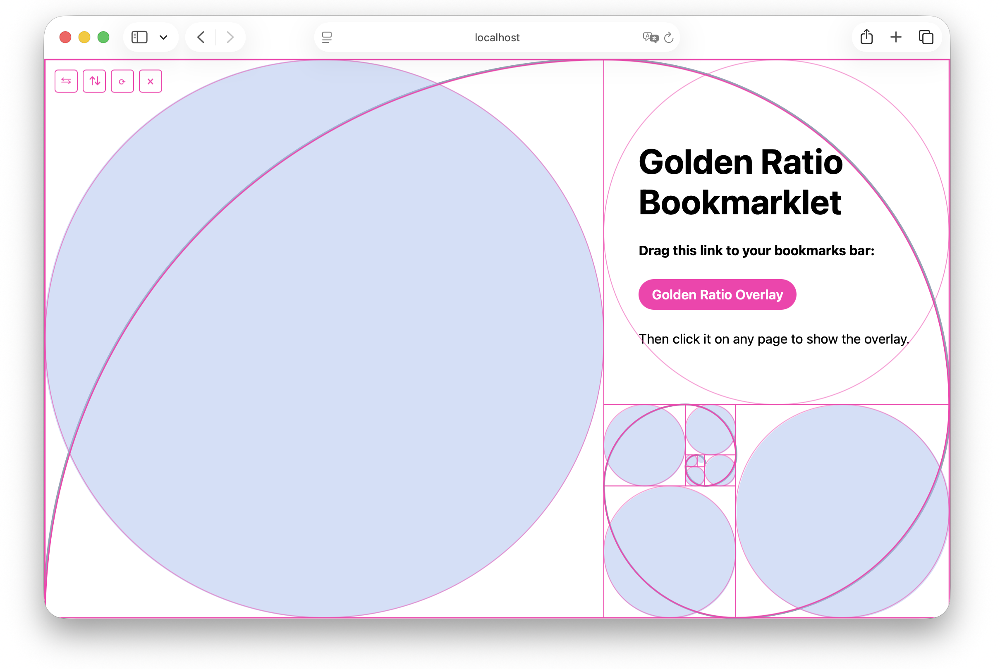

# Golden Ratio Bookmarklet

A bookmarklet that overlays a golden-ratio grid on top of any webpage.



## Install

Visit the [live demo page](https://daniel-marcus.github.io/golden-ratio-bookmarklet/) and drag the bookmarklet link into your bookmarks bar.

## Manual Install

1. Create a new bookmark in your browser (any page, any title).
2. Paste the code below as the bookmark's URL/address.

<!-- BOOKMARKLET:START -->
```text
javascript:(()%3D%3E%7Bvar%20c%3D(1%2BMath.sqrt(5))%2F2%3Bfunction%20X(p%2Co%2Cl%2Cb%2Cx%3D1)%7Blet%20m%3D%5B%5D%2Cf%3Dp%2Cy%3Do%2CA%3Dl%2C%24%3Db%2Cu%3DA%3E%3D%24%3F0%3A1%3Bwhile(Math.min(A%2C%24)%3E%3Dx)%7Blet%20r%3DMath.min(A%2C%24)%2CC%3Bswitch(u)%7Bcase%200%3AC%3D%7Bx%3Af%2Cy%2Csize%3Ar%2Ccut%3Au%7D%2Cf%2B%3Dr%2CA-%3Dr%3Bbreak%3Bcase%201%3AC%3D%7Bx%3Af%2Cy%3Ay%2B%24-r%2Csize%3Ar%2Ccut%3Au%7D%2C%24-%3Dr%3Bbreak%3Bcase%202%3AC%3D%7Bx%3Af%2BA-r%2Cy%2Csize%3Ar%2Ccut%3Au%7D%2CA-%3Dr%3Bbreak%3Bdefault%3AC%3D%7Bx%3Af%2Cy%2Csize%3Ar%2Ccut%3Au%7D%2Cy%2B%3Dr%2C%24-%3Dr%3Bbreak%7Dm.push(C)%2Cu%3D(u%2B1)%254%7Dreturn%20m%7Dfunction%20_(p)%7Blet%7Bx%3Ao%2Cy%3Al%2Csize%3Ab%2Ccut%3Ax%7D%3Dp%2Cm%3D%7Bx%3Ao%2Cy%3Al%7D%2Cf%3D%7Bx%3Ao%2Bb%2Cy%3Al%7D%2Cy%3D%7Bx%3Ao%2Cy%3Al%2Bb%7D%2CA%3D%7Bx%3Ao%2Bb%2Cy%3Al%2Bb%7D%3Bswitch(x)%7Bcase%200%3Areturn%7Bcx%3Af.x%2Ccy%3Af.y%2Cr%3Ab%2CfromX%3Am.x%2CfromY%3Am.y%2CtoX%3AA.x%2CtoY%3AA.y%7D%3Bcase%201%3Areturn%7Bcx%3Am.x%2Ccy%3Am.y%2Cr%3Ab%2CfromX%3Ay.x%2CfromY%3Ay.y%2CtoX%3Af.x%2CtoY%3Af.y%7D%3Bcase%202%3Areturn%7Bcx%3Ay.x%2Ccy%3Ay.y%2Cr%3Ab%2CfromX%3AA.x%2CfromY%3AA.y%2CtoX%3Am.x%2CtoY%3Am.y%7D%3Bdefault%3Areturn%7Bcx%3AA.x%2Ccy%3AA.y%2Cr%3Ab%2CfromX%3Af.x%2CfromY%3Af.y%2CtoX%3Ay.x%2CtoY%3Ay.y%7D%7D%7Dfunction%20j(p)%7Blet%7Bx%3Ao%2Cy%3Al%2Csize%3Ab%7D%3Dp%3Breturn%7Bcx%3Ao%2Bb%2F2%2Ccy%3Al%2Bb%2F2%2Cr%3Ab%2F2%7D%7Dvar%20G%3D%22golden-ratio-bookmarklet-overlay%22%2CP%3D%22http%3A%2F%2Fwww.w3.org%2F2000%2Fsvg%22%2CM%3D%22%23ff2fb0%22%2CI%3D6%2CQ%3D%5B%22top-left%22%2C%22top-right%22%2C%22bottom-left%22%2C%22bottom-right%22%5D%2CW%3D%7B%22top-left%22%3A%7Btop%3A%22-8px%22%2Cleft%3A%22-8px%22%2Ccursor%3A%22nwse-resize%22%7D%2C%22top-right%22%3A%7Btop%3A%22-8px%22%2Cright%3A%22-8px%22%2Ccursor%3A%22nesw-resize%22%7D%2C%22bottom-left%22%3A%7Bbottom%3A%22-8px%22%2Cleft%3A%22-8px%22%2Ccursor%3A%22nesw-resize%22%7D%2C%22bottom-right%22%3A%7Bbottom%3A%22-8px%22%2Cright%3A%22-8px%22%2Ccursor%3A%22nwse-resize%22%7D%7D%3Bfunction%20B(p)%7Blet%20o%3Ddocument.createElement(%22div%22)%3Bo.style.position%3D%22absolute%22%3Blet%20l%3DW%5Bp%5D%3Bif(l.top)o.style.top%3Dl.top%3Bif(l.bottom)o.style.bottom%3Dl.bottom%3Bif(l.left)o.style.left%3Dl.left%3Bif(l.right)o.style.right%3Dl.right%3Breturn%20o.style.width%3D%2216px%22%2Co.style.height%3D%2216px%22%2Co.style.borderRadius%3D%2250%25%22%2Co.style.background%3DM%2Co.style.cursor%3Dl.cursor%2Co.style.pointerEvents%3D%22auto%22%2Co%7Dvar%20k%3D14%3Bfunction%20s(p)%7Breturn%20document.createElementNS(P%2Cp)%7Dfunction%20Y()%7Blet%20p%3Ddocument.createElement(%22div%22)%3Bp.id%3DG%2Cp.style.position%3D%22fixed%22%2Cp.style.left%3D%2250%25%22%2Cp.style.top%3D%2250%25%22%2Cp.style.zIndex%3D%222147483647%22%2Cp.style.boxSizing%3D%22border-box%22%2Cp.style.border%3D%601px%20solid%20%24%7BM%7D%60%2Cp.style.pointerEvents%3D%22none%22%3Blet%20o%3Ds(%22svg%22)%3Bo.style.position%3D%22absolute%22%2Co.style.inset%3D%220%22%2Co.style.width%3D%22100%25%22%2Co.style.height%3D%22100%25%22%2Co.style.overflow%3D%22visible%22%2Cp.appendChild(o)%3Blet%20l%3Ddocument.createElement(%22div%22)%3Bl.style.position%3D%22absolute%22%2Cl.style.inset%3D%220%22%2Cl.style.pointerEvents%3D%22none%22%3Bfor(let%20m%20of%5B%22top%22%2C%22bottom%22%2C%22left%22%2C%22right%22%5D)%7Blet%20f%3Ddocument.createElement(%22div%22)%3Bif(f.style.position%3D%22absolute%22%2Cf.style.pointerEvents%3D%22auto%22%2Cf.style.cursor%3D%22move%22%2Cm%3D%3D%3D%22top%22%7C%7Cm%3D%3D%3D%22bottom%22)f.style%5Bm%5D%3D%60%24%7B-k%2F2%7Dpx%60%2Cf.style.left%3D%220%22%2Cf.style.width%3D%22100%25%22%2Cf.style.height%3D%60%24%7Bk%7Dpx%60%3Belse%20f.style%5Bm%5D%3D%60%24%7B-k%2F2%7Dpx%60%2Cf.style.top%3D%220%22%2Cf.style.height%3D%22100%25%22%2Cf.style.width%3D%60%24%7Bk%7Dpx%60%3Bl.appendChild(f)%7Dp.appendChild(l)%3Blet%20b%3DObject.fromEntries(Q.map((m)%3D%3E%5Bm%2CB(m)%5D))%3Bfor(let%20m%20of%20Q)p.appendChild(b%5Bm%5D)%3Blet%20x%3Ddocument.createElement(%22div%22)%3Breturn%20x.style.position%3D%22absolute%22%2Cx.style.top%3D%228px%22%2Cx.style.left%3D%228px%22%2Cx.style.display%3D%22flex%22%2Cx.style.gap%3D%226px%22%2Cx.style.padding%3D%224px%22%2Cx.style.borderRadius%3D%226px%22%2Cx.style.background%3D%22transparent%22%2Cx.style.pointerEvents%3D%22auto%22%2Cp.appendChild(x)%2C%7Broot%3Ap%2Csvg%3Ao%2Chandles%3Ab%2Ccontrols%3Ax%2CdragFrame%3Al%7D%7Dfunction%20E(p%2Co)%7Blet%7Broot%3Al%2Csvg%3Ab%7D%3Dp%3Bl.style.width%3D%60%24%7Bo.width%7Dpx%60%2Cl.style.height%3D%60%24%7Bo.height%7Dpx%60%2Cl.style.transform%3D%60translate(calc(-50%25%20%2B%20%24%7Bo.offsetX%7Dpx)%2C%20calc(-50%25%20%2B%20%24%7Bo.offsetY%7Dpx))%60%2Cb.setAttribute(%22viewBox%22%2C%600%200%20%24%7Bo.width%7D%20%24%7Bo.height%7D%60)%2Cb.style.transform%3D%60scale(%24%7Bo.flippedX%3F-1%3A1%7D%2C%20%24%7Bo.flippedY%3F-1%3A1%7D)%60%2Cb.replaceChildren()%3Blet%20x%3DMath.max(I%2CMath.min(o.width%2Co.height)*0.015)%2Cm%3DX(0%2C0%2Co.width%2Co.height%2Cx)%3Bfor(let%20f%20of%20m)%7Blet%20y%3Ds(%22rect%22)%3By.setAttribute(%22x%22%2CString(f.x))%2Cy.setAttribute(%22y%22%2CString(f.y))%2Cy.setAttribute(%22width%22%2CString(f.size))%2Cy.setAttribute(%22height%22%2CString(f.size))%2Cy.setAttribute(%22fill%22%2C%22none%22)%2Cy.setAttribute(%22stroke%22%2CM)%2Cy.setAttribute(%22stroke-width%22%2C%221%22)%2Cb.appendChild(y)%3Blet%20A%3D_(f)%2C%24%3Ds(%22path%22)%3B%24.setAttribute(%22d%22%2C%60M%20%24%7BA.fromX%7D%20%24%7BA.fromY%7D%20A%20%24%7BA.r%7D%20%24%7BA.r%7D%200%200%200%20%24%7BA.toX%7D%20%24%7BA.toY%7D%60)%2C%24.setAttribute(%22fill%22%2C%22none%22)%2C%24.setAttribute(%22stroke%22%2CM)%2C%24.setAttribute(%22stroke-width%22%2C%221.5%22)%2Cb.appendChild(%24)%3Blet%20u%3Dj(f)%2Cr%3Ds(%22circle%22)%3Br.setAttribute(%22cx%22%2CString(u.cx))%2Cr.setAttribute(%22cy%22%2CString(u.cy))%2Cr.setAttribute(%22r%22%2CString(u.r))%2Cr.setAttribute(%22fill%22%2C%22none%22)%2Cr.setAttribute(%22stroke%22%2CM)%2Cr.setAttribute(%22stroke-width%22%2C%221%22)%2Cr.setAttribute(%22stroke-opacity%22%2C%220.6%22)%2Cb.appendChild(r)%7D%7Dvar%20H%3D40%3Bfunction%20g(p%2Co)%7Blet%20l%3Dp%3E%3Do%3F%22landscape%22%3A%22portrait%22%3Bif(l%3D%3D%3D%22landscape%22)%7Blet%20x%3DMath.min(p%2Co*c)%3Breturn%7Bwidth%3Ax%2Cheight%3Ax%2Fc%2Corientation%3Al%2CflippedX%3A!1%2CflippedY%3A!0%2CoffsetX%3A0%2CoffsetY%3A0%2Cresized%3A!1%7D%7Dlet%20b%3DMath.min(o%2Cp*c)%3Breturn%7Bwidth%3Ab%2Fc%2Cheight%3Ab%2Corientation%3Al%2CflippedX%3A!1%2CflippedY%3A!0%2CoffsetX%3A0%2CoffsetY%3A0%2Cresized%3A!1%7D%7Dfunction%20J(p%2Co%2Cl)%7Breturn%7B...p%2CoffsetX%3Ap.offsetX%2Bo%2CoffsetY%3Ap.offsetY%2Bl%7D%7Dfunction%20T(p%2Co%2Cl)%7Blet%20b%3Dp.orientation%3D%3D%3D%22landscape%22%3F%22portrait%22%3A%22landscape%22%3Bif(!p.resized)%7Bif(b%3D%3D%3D%22landscape%22)%7Blet%20f%3DMath.min(o%2Cl*c)%3Breturn%7B...p%2Cwidth%3Af%2Cheight%3Af%2Fc%2Corientation%3Ab%7D%7Dlet%20m%3DMath.min(l%2Co*c)%3Breturn%7B...p%2Cwidth%3Am%2Fc%2Cheight%3Am%2Corientation%3Ab%7D%7Dif(b%3D%3D%3D%22landscape%22)%7Blet%20m%3DMath.min(p.height%2Co%2Cl*c)%3Breturn%7B...p%2Cwidth%3Am%2Cheight%3Am%2Fc%2Corientation%3Ab%7D%7Dlet%20x%3DMath.min(p.width%2Cl%2Co*c)%3Breturn%7B...p%2Cwidth%3Ax%2Fc%2Cheight%3Ax%2Corientation%3Ab%7D%7Dfunction%20F(p)%7Breturn%7B...p%2CflippedX%3A!p.flippedX%7D%7Dfunction%20Z(p)%7Breturn%7B...p%2CflippedY%3A!p.flippedY%7D%7Dvar%20N%3D%7B%22top-left%22%3A%7Bx%3A-1%2Cy%3A-1%7D%2C%22top-right%22%3A%7Bx%3A1%2Cy%3A-1%7D%2C%22bottom-left%22%3A%7Bx%3A-1%2Cy%3A1%7D%2C%22bottom-right%22%3A%7Bx%3A1%2Cy%3A1%7D%7D%3Bfunction%20U(p%2Co%2Cl%2Cb%3DH)%7Blet%20x%3DMath.max(l%2Cb)%2Cm%3Dp.orientation%3D%3D%3D%22landscape%22%3Fx%3Ax%2Fc%2Cf%3Dp.orientation%3D%3D%3D%22landscape%22%3Fx%2Fc%3Ax%2Cy%3DN%5Bo%5D%2CA%3Dp.offsetX%2By.x*(m-p.width)%2F2%2C%24%3Dp.offsetY%2By.y*(f-p.height)%2F2%3Breturn%7B...p%2Cwidth%3Am%2Cheight%3Af%2CoffsetX%3AA%2CoffsetY%3A%24%2Cresized%3A!0%7D%7Dfunction%20K(p%2Co)%7Blet%20l%3Ddocument.createElement(%22button%22)%3Breturn%20l.textContent%3Dp%2Cl.dataset.action%3Do%2Cl.style.width%3D%2228px%22%2Cl.style.height%3D%2228px%22%2Cl.style.border%3D%221px%20solid%20%23ff2fb0%22%2Cl.style.borderRadius%3D%224px%22%2Cl.style.background%3D%22transparent%22%2Cl.style.color%3D%22%23ff2fb0%22%2Cl.style.cursor%3D%22pointer%22%2Cl.style.fontSize%3D%2214px%22%2Cl.style.lineHeight%3D%221%22%2Cl%7Dfunction%20n()%7Blet%20p%3Ddocument.getElementById(G)%3Bif(p)%7Bp.remove()%3Breturn%7Dlet%20o%3DY()%2Cl%3Dg(window.innerWidth%2Cwindow.innerHeight)%3BE(o%2Cl)%3Blet%20b%3D!1%3Bfunction%20x()%7Bif(b)return%3Bb%3D!0%2CrequestAnimationFrame(()%3D%3E%7Bb%3D!1%2CE(o%2Cl)%7D)%7Dlet%20m%3DK(%22%E2%87%86%22%2C%22flip-horizontal%22)%2Cf%3DK(%22%E2%87%85%22%2C%22flip-vertical%22)%2Cy%3DK(%22%E2%9F%B3%22%2C%22rotate%22)%2CA%3DK(%22%C3%97%22%2C%22close%22)%3Bo.controls.append(m%2Cf%2Cy%2CA)%2Cm.addEventListener(%22click%22%2C()%3D%3E%7Bl%3DF(l)%2CE(o%2Cl)%7D)%2Cf.addEventListener(%22click%22%2C()%3D%3E%7Bl%3DZ(l)%2CE(o%2Cl)%7D)%2Cy.addEventListener(%22click%22%2C()%3D%3E%7Bl%3DT(l%2Cwindow.innerWidth%2Cwindow.innerHeight)%2CE(o%2Cl)%7D)%2CA.addEventListener(%22click%22%2C()%3D%3E%7Bo.root.remove()%7D)%3Bfor(let%20%24%20of%20Object.keys(o.handles))o.handles%5B%24%5D.addEventListener(%22pointerdown%22%2C(u)%3D%3E%7Bu.preventDefault()%3Blet%7BclientX%3Ar%2CclientY%3AC%7D%3Du%2CS%3Dl%2Cd%3DN%5B%24%5D%3Bfunction%20D(V)%7Blet%20L%3DV.clientX-r%2CR%3DV.clientY-C%2Cq%3DS.orientation%3D%3D%3D%22landscape%22%3FS.width%2Bd.x*L%3AS.height%2Bd.y*R%3Bl%3DU(S%2C%24%2Cq)%2Cx()%7Dfunction%20O()%7Bwindow.removeEventListener(%22pointermove%22%2CD)%2Cwindow.removeEventListener(%22pointerup%22%2CO)%2CE(o%2Cl)%7Dwindow.addEventListener(%22pointermove%22%2CD)%2Cwindow.addEventListener(%22pointerup%22%2CO)%7D)%3Bo.dragFrame.addEventListener(%22pointerdown%22%2C(%24)%3D%3E%7B%24.preventDefault()%3Blet%7BclientX%3Au%2CclientY%3Ar%7D%3D%24%2CC%3Dl%3Bfunction%20S(D)%7Bl%3DJ(C%2CD.clientX-u%2CD.clientY-r)%2Cx()%7Dfunction%20d()%7Bwindow.removeEventListener(%22pointermove%22%2CS)%2Cwindow.removeEventListener(%22pointerup%22%2Cd)%2CE(o%2Cl)%7Dwindow.addEventListener(%22pointermove%22%2CS)%2Cwindow.addEventListener(%22pointerup%22%2Cd)%7D)%2Cdocument.body.appendChild(o.root)%7Dn()%3B%7D)()%3B%0A
```
<!-- BOOKMARKLET:END -->

## Development

Install dependencies:

```bash
bun install
```

Start the dev server — serves an example page with a draggable link that installs the current (unminified) bookmarklet:

```bash
bun run dev
```

Run the tests (red-green TDD; pure logic in `src/geometry.ts` and `src/overlay-state.ts`, DOM behavior in `src/overlay-dom.ts` and `src/bookmarklet.ts` via happy-dom):

```bash
bun test
```

Build the static demo page (with the minified bookmarklet baked into the install link) into `out/`, ready to publish to GitHub Pages:

```bash
bun run build
```
