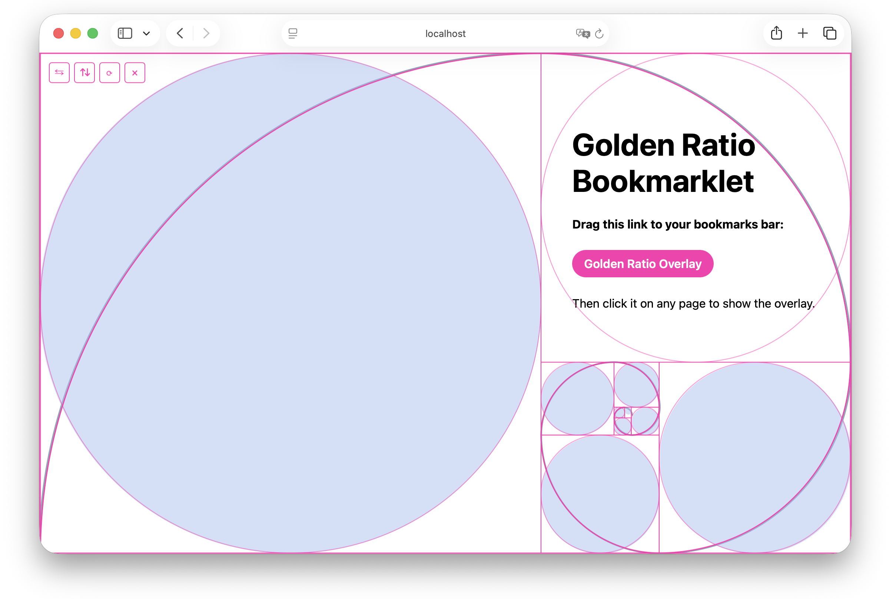

# Golden Ratio Bookmarklet

A bookmarklet that overlays a golden-ratio grid on top of any webpage.



## Install

Visit the [live demo page](https://daniel-marcus.github.io/golden-ratio-bookmarklet/) and drag the bookmarklet link into your bookmarks bar.

## Manual Install

1. Create a new bookmark in your browser (any page, any title).
2. Paste the code below as the bookmark's URL/address.

<!-- BOOKMARKLET:START -->

```text
javascript:(()%3D%3E%7Bvar%20f%3D(1%2BMath.sqrt(5))%2F2%3Bfunction%20O(o%2Ct%2Ce%2Cn%2Cs%3D1)%7Blet%20i%3D%5B%5D%2Cr%3Do%2Cc%3Dt%2Cp%3De%2Ca%3Dn%2Cl%3Dp%3E%3Da%3F0%3A1%3Bwhile(Math.min(p%2Ca)%3E%3Ds)%7Blet%20u%3DMath.min(p%2Ca)%2Cd%3Bswitch(l)%7Bcase%200%3Ad%3D%7Bx%3Ar%2Cy%3Ac%2Csize%3Au%2Ccut%3Al%7D%2Cr%2B%3Du%2Cp-%3Du%3Bbreak%3Bcase%201%3Ad%3D%7Bx%3Ar%2Cy%3Ac%2Ba-u%2Csize%3Au%2Ccut%3Al%7D%2Ca-%3Du%3Bbreak%3Bcase%202%3Ad%3D%7Bx%3Ar%2Bp-u%2Cy%3Ac%2Csize%3Au%2Ccut%3Al%7D%2Cp-%3Du%3Bbreak%3Bdefault%3Ad%3D%7Bx%3Ar%2Cy%3Ac%2Csize%3Au%2Ccut%3Al%7D%2Cc%2B%3Du%2Ca-%3Du%3Bbreak%7Di.push(d)%2Cl%3D(l%2B1)%254%7Dreturn%20i%7Dfunction%20L(o)%7Blet%7Bx%3At%2Cy%3Ae%2Csize%3An%2Ccut%3As%7D%3Do%2Ci%3D%7Bx%3At%2Cy%3Ae%7D%2Cr%3D%7Bx%3At%2Bn%2Cy%3Ae%7D%2Cc%3D%7Bx%3At%2Cy%3Ae%2Bn%7D%2Cp%3D%7Bx%3At%2Bn%2Cy%3Ae%2Bn%7D%3Bswitch(s)%7Bcase%200%3Areturn%7Bcx%3Ar.x%2Ccy%3Ar.y%2Cr%3An%2CfromX%3Ai.x%2CfromY%3Ai.y%2CtoX%3Ap.x%2CtoY%3Ap.y%7D%3Bcase%201%3Areturn%7Bcx%3Ai.x%2Ccy%3Ai.y%2Cr%3An%2CfromX%3Ac.x%2CfromY%3Ac.y%2CtoX%3Ar.x%2CtoY%3Ar.y%7D%3Bcase%202%3Areturn%7Bcx%3Ac.x%2Ccy%3Ac.y%2Cr%3An%2CfromX%3Ap.x%2CfromY%3Ap.y%2CtoX%3Ai.x%2CtoY%3Ai.y%7D%3Bdefault%3Areturn%7Bcx%3Ap.x%2Ccy%3Ap.y%2Cr%3An%2CfromX%3Ar.x%2CfromY%3Ar.y%2CtoX%3Ac.x%2CtoY%3Ac.y%7D%7D%7Dfunction%20Y(o)%7Blet%7Bx%3At%2Cy%3Ae%2Csize%3An%7D%3Do%3Breturn%7Bcx%3At%2Bn%2F2%2Ccy%3Ae%2Bn%2F2%2Cr%3An%2F2%7D%7Dvar%20S%3D%22golden-ratio-bookmarklet-overlay%22%2C_%3D%22http%3A%2F%2Fwww.w3.org%2F2000%2Fsvg%22%2Cb%3D%22%23ff2fb0%22%2CB%3D6%2Cz%3D%5B%22top-left%22%2C%22top-right%22%2C%22bottom-left%22%2C%22bottom-right%22%5D%2CF%3D%7B%22top-left%22%3A%7Btop%3A%22-8px%22%2Cleft%3A%22-8px%22%2Ccursor%3A%22nwse-resize%22%7D%2C%22top-right%22%3A%7Btop%3A%22-8px%22%2Cright%3A%22-8px%22%2Ccursor%3A%22nesw-resize%22%7D%2C%22bottom-left%22%3A%7Bbottom%3A%22-8px%22%2Cleft%3A%22-8px%22%2Ccursor%3A%22nesw-resize%22%7D%2C%22bottom-right%22%3A%7Bbottom%3A%22-8px%22%2Cright%3A%22-8px%22%2Ccursor%3A%22nwse-resize%22%7D%7D%3Bfunction%20G(o)%7Blet%20t%3Ddocument.createElement(%22div%22)%3Bt.style.position%3D%22absolute%22%3Blet%20e%3DF%5Bo%5D%3Bif(e.top)t.style.top%3De.top%3Bif(e.bottom)t.style.bottom%3De.bottom%3Bif(e.left)t.style.left%3De.left%3Bif(e.right)t.style.right%3De.right%3Breturn%20t.style.width%3D%2216px%22%2Ct.style.height%3D%2216px%22%2Ct.style.borderRadius%3D%2250%25%22%2Ct.style.background%3Db%2Ct.style.cursor%3De.cursor%2Ct.style.pointerEvents%3D%22auto%22%2Ct.style.touchAction%3D%22none%22%2Ct%7Dvar%20g%3D14%3Bfunction%20v(o)%7Breturn%20document.createElementNS(_%2Co)%7Dfunction%20X()%7Blet%20o%3Ddocument.createElement(%22div%22)%3Bo.id%3DS%2Co.style.position%3D%22fixed%22%2Co.style.left%3D%2250%25%22%2Co.style.top%3D%2250%25%22%2Co.style.zIndex%3D%222147483647%22%2Co.style.boxSizing%3D%22border-box%22%2Co.style.border%3D%601px%20solid%20%24%7Bb%7D%60%2Co.style.pointerEvents%3D%22none%22%3Blet%20t%3Dv(%22svg%22)%3Bt.style.position%3D%22absolute%22%2Ct.style.left%3D%2250%25%22%2Ct.style.top%3D%2250%25%22%2Ct.style.overflow%3D%22visible%22%2Co.appendChild(t)%3Blet%20e%3Ddocument.createElement(%22div%22)%3Be.style.position%3D%22absolute%22%2Ce.style.inset%3D%220%22%2Ce.style.pointerEvents%3D%22none%22%3Bfor(let%20i%20of%5B%22top%22%2C%22bottom%22%2C%22left%22%2C%22right%22%5D)%7Blet%20r%3Ddocument.createElement(%22div%22)%3Bif(r.style.position%3D%22absolute%22%2Cr.style.pointerEvents%3D%22auto%22%2Cr.style.cursor%3D%22move%22%2Cr.style.touchAction%3D%22none%22%2Ci%3D%3D%3D%22top%22%7C%7Ci%3D%3D%3D%22bottom%22)r.style%5Bi%5D%3D%60%24%7B-g%2F2%7Dpx%60%2Cr.style.left%3D%220%22%2Cr.style.width%3D%22100%25%22%2Cr.style.height%3D%60%24%7Bg%7Dpx%60%3Belse%20r.style%5Bi%5D%3D%60%24%7B-g%2F2%7Dpx%60%2Cr.style.top%3D%220%22%2Cr.style.height%3D%22100%25%22%2Cr.style.width%3D%60%24%7Bg%7Dpx%60%3Be.appendChild(r)%7Do.appendChild(e)%3Blet%20n%3DObject.fromEntries(z.map((i)%3D%3E%5Bi%2CG(i)%5D))%3Bfor(let%20i%20of%20z)o.appendChild(n%5Bi%5D)%3Blet%20s%3Ddocument.createElement(%22div%22)%3Breturn%20s.style.position%3D%22absolute%22%2Cs.style.top%3D%228px%22%2Cs.style.left%3D%228px%22%2Cs.style.display%3D%22flex%22%2Cs.style.gap%3D%226px%22%2Cs.style.padding%3D%224px%22%2Cs.style.borderRadius%3D%226px%22%2Cs.style.background%3D%22transparent%22%2Cs.style.pointerEvents%3D%22auto%22%2Co.appendChild(s)%2C%7Broot%3Ao%2Csvg%3At%2Chandles%3An%2Ccontrols%3As%2CdragFrame%3Ae%7D%7Dfunction%20h(o%2Ct)%7Blet%7Broot%3Ae%2Csvg%3An%7D%3Do%3Be.style.width%3D%60%24%7Bt.width%7Dpx%60%2Ce.style.height%3D%60%24%7Bt.height%7Dpx%60%2Ce.style.transform%3D%60translate(calc(-50%25%20%2B%20%24%7Bt.offsetX%7Dpx)%2C%20calc(-50%25%20%2B%20%24%7Bt.offsetY%7Dpx))%60%3Blet%20s%3Dt.rotation%252%3D%3D%3D1%2Ci%3Ds%3Ft.height%3At.width%2Cr%3Ds%3Ft.width%3At.height%3Bn.style.width%3D%60%24%7Bi%7Dpx%60%2Cn.style.height%3D%60%24%7Br%7Dpx%60%2Cn.style.transform%3D%60translate(-50%25%2C%20-50%25)%20rotate(%24%7Bt.rotation*90%7Ddeg)%20scale(%24%7Bt.flipped%3F-1%3A1%7D%2C%201)%60%2Cn.setAttribute(%22viewBox%22%2C%600%200%20%24%7Bi%7D%20%24%7Br%7D%60)%2Cn.replaceChildren()%3Blet%20c%3DMath.max(B%2CMath.min(i%2Cr)*0.015)%2Cp%3DO(0%2C0%2Ci%2Cr%2Cc)%3Bfor(let%20a%20of%20p)%7Blet%20l%3Dv(%22rect%22)%3Bl.setAttribute(%22x%22%2CString(a.x))%2Cl.setAttribute(%22y%22%2CString(a.y))%2Cl.setAttribute(%22width%22%2CString(a.size))%2Cl.setAttribute(%22height%22%2CString(a.size))%2Cl.setAttribute(%22fill%22%2C%22none%22)%2Cl.setAttribute(%22stroke%22%2Cb)%2Cl.setAttribute(%22stroke-width%22%2C%221%22)%2Cn.appendChild(l)%3Blet%20u%3DL(a)%2Cd%3Dv(%22path%22)%3Bd.setAttribute(%22d%22%2C%60M%20%24%7Bu.fromX%7D%20%24%7Bu.fromY%7D%20A%20%24%7Bu.r%7D%20%24%7Bu.r%7D%200%200%200%20%24%7Bu.toX%7D%20%24%7Bu.toY%7D%60)%2Cd.setAttribute(%22fill%22%2C%22none%22)%2Cd.setAttribute(%22stroke%22%2Cb)%2Cd.setAttribute(%22stroke-width%22%2C%221.5%22)%2Cn.appendChild(d)%3Blet%20m%3DY(a)%2Cy%3Dv(%22circle%22)%3By.setAttribute(%22cx%22%2CString(m.cx))%2Cy.setAttribute(%22cy%22%2CString(m.cy))%2Cy.setAttribute(%22r%22%2CString(m.r))%2Cy.setAttribute(%22fill%22%2C%22none%22)%2Cy.setAttribute(%22stroke%22%2Cb)%2Cy.setAttribute(%22stroke-width%22%2C%221%22)%2Cy.setAttribute(%22stroke-opacity%22%2C%220.6%22)%2Cn.appendChild(y)%7D%7Dvar%20P%3D40%3Bfunction%20M(o%2Ct)%7Bif(o%3E%3Dt)%7Blet%20s%3DMath.min(o%2Ct*f)%3Breturn%7Bwidth%3As%2Cheight%3As%2Ff%2Crotation%3A2%2Cflipped%3A!0%2CoffsetX%3A0%2CoffsetY%3A0%2Cresized%3A!1%7D%7Dlet%20n%3DMath.min(t%2Co*f)%3Breturn%7Bwidth%3An%2Ff%2Cheight%3An%2Crotation%3A3%2Cflipped%3A!0%2CoffsetX%3A0%2CoffsetY%3A0%2Cresized%3A!1%7D%7Dfunction%20R(o%2Ct%2Ce)%7Breturn%7B...o%2CoffsetX%3Ao.offsetX%2Bt%2CoffsetY%3Ao.offsetY%2Be%7D%7Dfunction%20k(o%2Ct%2Ce)%7Blet%20n%3D(o.rotation%2B1)%254%2Cs%3Dn%252%3D%3D%3D0%3Bif(!o.resized)%7Bif(s)%7Blet%20c%3DMath.min(t%2Ce*f)%3Breturn%7B...o%2Cwidth%3Ac%2Cheight%3Ac%2Ff%2Crotation%3An%7D%7Dlet%20r%3DMath.min(e%2Ct*f)%3Breturn%7B...o%2Cwidth%3Ar%2Ff%2Cheight%3Ar%2Crotation%3An%7D%7Dif(s)%7Blet%20r%3DMath.min(o.height%2Ct%2Ce*f)%3Breturn%7B...o%2Cwidth%3Ar%2Cheight%3Ar%2Ff%2Crotation%3An%7D%7Dlet%20i%3DMath.min(o.width%2Ce%2Ct*f)%3Breturn%7B...o%2Cwidth%3Ai%2Ff%2Cheight%3Ai%2Crotation%3An%7D%7Dfunction%20T(o)%7Breturn%7B...o%2Cflipped%3A!o.flipped%7D%7Dvar%20w%3D%7B%22top-left%22%3A%7Bx%3A-1%2Cy%3A-1%7D%2C%22top-right%22%3A%7Bx%3A1%2Cy%3A-1%7D%2C%22bottom-left%22%3A%7Bx%3A-1%2Cy%3A1%7D%2C%22bottom-right%22%3A%7Bx%3A1%2Cy%3A1%7D%7D%3Bfunction%20q(o%2Ct%2Ce%2Cn%3DP)%7Blet%20s%3DMath.max(e%2Cn)%2Ci%3Do.rotation%252%3D%3D%3D0%2Cr%3Di%3Fs%3As%2Ff%2Cc%3Di%3Fs%2Ff%3As%2Cp%3Dw%5Bt%5D%2Ca%3Do.offsetX%2Bp.x*(r-o.width)%2F2%2Cl%3Do.offsetY%2Bp.y*(c-o.height)%2F2%3Breturn%7B...o%2Cwidth%3Ar%2Cheight%3Ac%2CoffsetX%3Aa%2CoffsetY%3Al%2Cresized%3A!0%7D%7Dfunction%20E(o%2Ct)%7Blet%20e%3Ddocument.createElement(%22button%22)%3Breturn%20e.textContent%3Do%2Ce.dataset.action%3Dt%2Ce.style.width%3D%2228px%22%2Ce.style.height%3D%2228px%22%2Ce.style.border%3D%221px%20solid%20%23ff2fb0%22%2Ce.style.borderRadius%3D%224px%22%2Ce.style.background%3D%22transparent%22%2Ce.style.color%3D%22%23ff2fb0%22%2Ce.style.cursor%3D%22pointer%22%2Ce.style.fontSize%3D%2214px%22%2Ce.style.lineHeight%3D%221%22%2Ce%7Dfunction%20I()%7Blet%20o%3Ddocument.getElementById(S)%3Bif(o)%7Bo.remove()%3Breturn%7Dlet%20t%3DX()%2Ce%3DM(window.innerWidth%2Cwindow.innerHeight)%3Bh(t%2Ce)%3Blet%20n%3D!1%3Bfunction%20s()%7Bif(n)return%3Bn%3D!0%2CrequestAnimationFrame(()%3D%3E%7Bn%3D!1%2Ch(t%2Ce)%7D)%7Dlet%20i%3DE(%22%E2%87%86%22%2C%22flip-horizontal%22)%2Cr%3DE(%22%E2%9F%B3%22%2C%22rotate%22)%2Cc%3DE(%22%C3%97%22%2C%22close%22)%3Bt.controls.append(i%2Cr%2Cc)%3Bfunction%20p()%7Bi.textContent%3De.rotation%252%3D%3D%3D0%3F%22%E2%87%86%22%3A%22%E2%87%85%22%7Dp()%2Ci.addEventListener(%22click%22%2C()%3D%3E%7Be%3DT(e)%2Ch(t%2Ce)%7D)%2Cr.addEventListener(%22click%22%2C()%3D%3E%7Be%3Dk(e%2Cwindow.innerWidth%2Cwindow.innerHeight)%2Ch(t%2Ce)%2Cp()%7D)%2Cc.addEventListener(%22click%22%2C()%3D%3E%7Bt.root.remove()%7D)%3Bfor(let%20a%20of%20Object.keys(t.handles))t.handles%5Ba%5D.addEventListener(%22pointerdown%22%2C(l)%3D%3E%7Bl.preventDefault()%3Blet%7BclientX%3Au%2CclientY%3Ad%7D%3Dl%2Cm%3De%2Cy%3Dw%5Ba%5D%3Bfunction%20x(A)%7Blet%20H%3DA.clientX-u%2CN%3DA.clientY-d%2CD%3Dm.rotation%252%3D%3D%3D0%3Fm.width%2By.x*H%3Am.height%2By.y*N%3Be%3Dq(m%2Ca%2CD)%2Cs()%7Dfunction%20C()%7Bwindow.removeEventListener(%22pointermove%22%2Cx)%2Cwindow.removeEventListener(%22pointerup%22%2CC)%2Ch(t%2Ce)%7Dwindow.addEventListener(%22pointermove%22%2Cx)%2Cwindow.addEventListener(%22pointerup%22%2CC)%7D)%3Bt.dragFrame.addEventListener(%22pointerdown%22%2C(a)%3D%3E%7Ba.preventDefault()%3Blet%7BclientX%3Al%2CclientY%3Au%7D%3Da%2Cd%3De%3Bfunction%20m(x)%7Be%3DR(d%2Cx.clientX-l%2Cx.clientY-u)%2Cs()%7Dfunction%20y()%7Bwindow.removeEventListener(%22pointermove%22%2Cm)%2Cwindow.removeEventListener(%22pointerup%22%2Cy)%2Ch(t%2Ce)%7Dwindow.addEventListener(%22pointermove%22%2Cm)%2Cwindow.addEventListener(%22pointerup%22%2Cy)%7D)%2Cdocument.body.appendChild(t.root)%7DI()%3B%7D)()%3B%0A
```

<!-- BOOKMARKLET:END -->

## Development

Install dependencies:

```bash
bun install
```

Start the dev server — serves an example page with a draggable link that installs the current (unminified) bookmarklet:

```bash
bun run dev
```

Run the tests (red-green TDD; pure logic in `src/geometry.ts` and `src/overlay-state.ts`, DOM behavior in `src/overlay-dom.ts` and `src/bookmarklet.ts` via happy-dom):

```bash
bun test
```

Build the static demo page (with the minified bookmarklet baked into the install link) into `out/`, ready to publish to GitHub Pages:

```bash
bun run build
```
